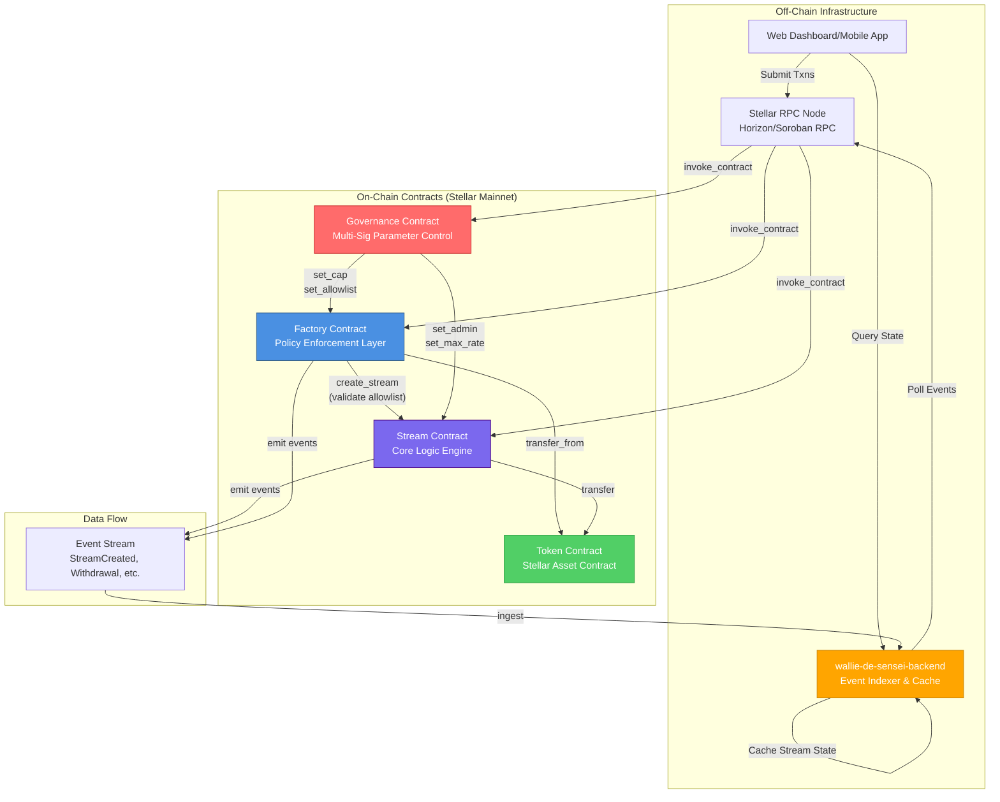
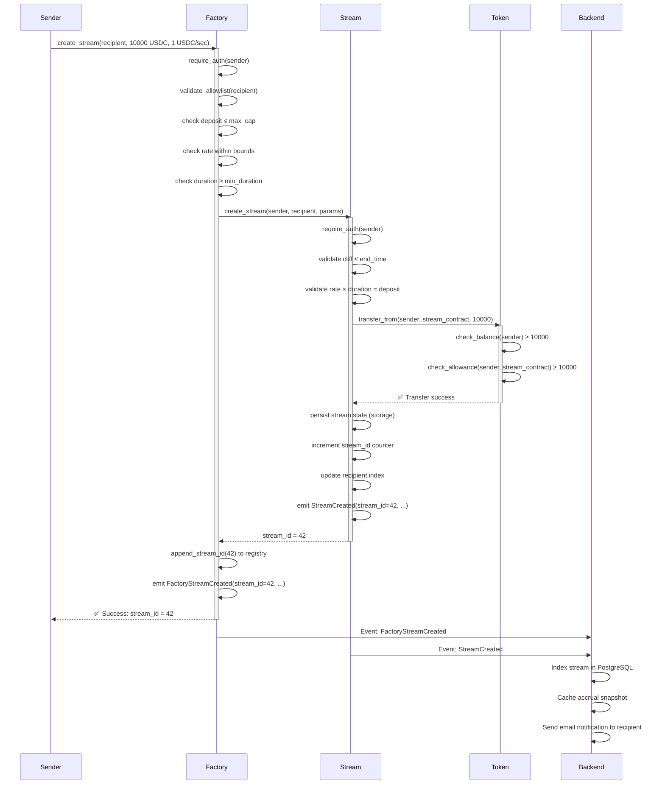

# Wallie de Sensei Smart Contracts

**Enterprise-grade Soroban smart contracts for programmable treasury management and token streaming on Stellar.**

[](https://stellar.org)
[](https://www.rust-lang.org)
[](LICENSE)
[](https://github.com/wallie-de-sensei/wallie-de-sensei-contracts)

---

## 📋 Table of Contents

- [On-Chain System Overview](#on-chain-system-overview--value-proposition)
- [Contract Architecture](#contract-relationship--architecture)
- [Repository Scope](#repository-scope-of-work-sow--contract-matrix)
- [Transaction Flow](#transaction-flow--security-sequence)
- [Technical Stack](#soroban-tech-stack-development--compilation)
- [Security & Auditing](#security-auditing--guardrails)
- [Contributing](#contributing)

---

## 🎯 On-Chain System Overview & Value Proposition

Wallie de Sensei is a **decentralized treasury streaming protocol** built on Stellar's Soroban smart contract platform. It enables organizations to automate token-based compensation, vesting schedules, and continuous payment flows with cryptographic precision and full on-chain auditability.

### Core Value Propositions

**1. Programmable Payment Streams**
- Lock tokens into time-bounded streams with configurable rates, cliffs, and durations
- Recipients withdraw accrued tokens permissionlessly at any time after the cliff period
- Senders retain administrative control (pause, cancel, rate adjustments) while streams are active

**2. Treasury Management Primitives**
- **Factory-gated stream creation**: Enforce allowlists, deposit caps, and minimum durations
- **Governance-controlled parameters**: Multi-signature approval system for critical protocol changes
- **Batch operations**: Create or withdraw from multiple streams atomically to minimize gas costs

**3. Enterprise Financial Mechanisms**
- **Cliff vesting**: Lock liquidity until a milestone timestamp, then enable linear accrual
- **Cliff-only unlocks**: One-shot full-deposit releases at a target date (grants, retroactive payments)
- **Keeper incentives**: Decentralized cleanup of expired streams with protocol fee splits
- **Auto-claim destinations**: Recipients pre-authorize a final withdrawal address for permissionless finalization

**4. Off-Chain Integration Layer**
- Comprehensive event emission for real-time indexing by backend systems
- Structured metadata fields (invoice IDs, project codes) embedded on-chain
- Paginated query endpoints for dashboard UIs and accounting reconciliation

### Use Cases

| Scenario | Implementation |
|----------|----------------|
| **Payroll streaming** | Create monthly streams from treasury to employees with 30-day linear vesting |
| **Investor vesting** | Cliff-only streams for seed round tokens unlocking after 12-month lockup |
| **Contractor payments** | Factory-enforced allowlist ensures only approved vendors receive streams |
| **Grant distribution** | Governance-approved parameter changes (rate caps, recipient allowlists) |
| **DAO treasury ops** | Multi-signature governance contract authorizes all admin-level mutations |

---

---

## 🏗️ Contract Relationship & Architecture

### System Architecture Diagram



### Contract Interaction Patterns

#### 1. Stream Creation Flow
```
User → Factory.create_stream() 
  ├─ Validate: recipient in allowlist
  ├─ Validate: deposit ≤ max_cap
  ├─ Validate: duration ≥ min_duration
  ├─ Validate: rate within bounds
  └─ Stream.create_stream()
      ├─ Token.transfer_from(sender, contract, deposit)
      ├─ Persist stream state
      └─ Emit: StreamCreated(stream_id, sender, recipient, ...)
```

#### 2. Withdrawal Flow
```
Recipient → Stream.withdraw(stream_id)
  ├─ Auth: recipient.require_auth()
  ├─ Calculate: accrued = min((now - start) × rate, deposit)
  ├─ Calculate: withdrawable = accrued - withdrawn
  ├─ Token.transfer(contract, recipient, withdrawable)
  ├─ Update: stream.withdrawn_amount += withdrawable
  ├─ Check: if withdrawn == deposit → status = Completed
  └─ Emit: Withdrawal(stream_id, recipient, withdrawable)
```

#### 3. Governance Parameter Update
```
Proposer → Governance.propose(target, calldata)
Co-signers → Governance.approve(proposal_id) [× threshold times]
  └─ When quorum reached → timelock starts (48h)
Executor → Governance.execute(proposal_id)
  └─ Stream.set_max_rate_per_second(new_rate)
      └─ Emit: RateBoundsUpdated(min, max)
```

### Backend Integration Points

The `wallie-de-sensei-backend` service indexes on-chain events for:
- **Real-time dashboards**: Stream health, accrual rates, withdrawal history
- **Notification triggers**: Stream completion, underfunding alerts, governance proposals
- **Accounting exports**: Paginated stream queries (`get_factory_streams_paginated`)
- **Caching layer**: Reduces RPC load by maintaining indexed stream state

---

## 📊 Repository Scope of Work (SOW) & Contract Matrix

### Contract Responsibility Matrix

| Contract | Primary Responsibility | Key Methods | State Managed On-Chain | Events for Backend | Status |
|----------|------------------------|-------------|------------------------|-------------------|--------|
| **`stream`**<br/>`contracts/stream` | Core streaming logic<br/>Accrual calculations<br/>Recipient withdrawals<br/>Stream lifecycle | `init`<br/>`create_stream`<br/>`withdraw`<br/>`pause_stream`<br/>`cancel_stream`<br/>`update_rate_per_second`<br/>`close_completed_stream` | • Stream configs (sender, recipient, deposit, rate)<br/>• Accrual checkpoints<br/>• Withdrawal history<br/>• Stream status (Active/Paused/Completed/Cancelled)<br/>• Template registry<br/>• Recipient stream index | ✅ `StreamCreated`<br/>✅ `Withdrawal`<br/>✅ `StreamPaused/Resumed`<br/>✅ `StreamCancelled`<br/>✅ `RateUpdated`<br/>✅ `StreamCompleted` | ✅ Deployed |
| **`factory`**<br/>`contracts/factory` | Policy enforcement gateway<br/>Allowlist validation<br/>Deposit caps<br/>Rate bounds | `init`<br/>`create_stream`<br/>`set_allowlist`<br/>`set_cap`<br/>`set_rate_bounds`<br/>`is_allowlisted` | • Admin address<br/>• Stream contract pointer<br/>• Max deposit cap<br/>• Min stream duration<br/>• Rate bounds (min/max)<br/>• Recipient allowlist<br/>• Factory-created stream registry | ✅ `FactoryStreamCreated`<br/>✅ `AllowlistUpdated`<br/>✅ `CapUpdated`<br/>✅ `RateBoundsUpdated` | ✅ Deployed |
| **`governance`**<br/>`contracts/governance` | Multi-signature proposals<br/>Timelock enforcement<br/>Parameter change authorization | `init`<br/>`propose`<br/>`approve`<br/>`execute`<br/>`add_signer`<br/>`remove_signer` | • Admin address<br/>• Co-signer list<br/>• Approval threshold<br/>• Proposal records<br/>• Quorum timestamps<br/>• Execution status | ✅ `ProposalCreated`<br/>✅ `ProposalApproved`<br/>✅ `QuorumReached`<br/>✅ `ProposalExecuted` | ✅ Deployed |

### On-Chain vs. Off-Chain Scope

#### ✅ Handled Strictly On-Chain
- **Token custody**: All stream deposits locked in stream contract
- **Accrual math**: Time-based token release calculations (`(now - start) × rate_per_second`)
- **Authorization**: Soroban native `require_auth()` for sender/recipient/admin operations
- **State transitions**: Stream status (Active → Paused → Cancelled → Completed)
- **Atomicity**: Batch operations (create/withdraw multiple streams) execute all-or-nothing
- **Governance enforcement**: 48-hour timelock + quorum threshold validation

#### 🔄 Indexed & Cached Off-Chain (Backend)
- **Event aggregation**: Subscribe to contract events via Stellar RPC
- **Stream search**: Full-text search across sender/recipient addresses, metadata fields
- **Pagination**: Serve UI queries from indexed DB instead of on-chain iteration
- **Notifications**: Email/push alerts on stream completion, low balance warnings
- **Analytics**: Historical withdrawal patterns, treasury velocity metrics
- **Reconciliation**: Match on-chain events to off-chain invoices via embedded metadata

#### 🚫 Not Handled by Contracts
- **Fiat conversion**: Backend converts token amounts to USD for UI display
- **User authentication**: Backend validates wallet signatures for dashboard access
- **Email delivery**: Notification service triggered by backend event processing
- **Compliance reports**: Backend generates CSV exports from indexed stream data

---

## 🔄 Transaction Flow & Security Sequence

### Critical Flow: Factory-Gated Stream Creation with Authorization



### Security Checkpoints

| Layer | Mechanism | Enforcement Point |
|-------|-----------|-------------------|
| **Authorization** | Soroban `require_auth()` | Every state-mutating function validates caller signature |
| **Access Control** | Role-based permissions | Sender-only: pause/cancel/rate updates<br/>Recipient-only: withdraw<br/>Admin-only: global pause, admin rotation |
| **Reentrancy Guards** | CEI pattern | State changes precede external calls (token transfers) |
| **Integer Overflow** | Checked arithmetic | All accrual calculations use `checked_add/checked_mul` with fallback to `deposit_amount` |
| **Rate Limiting** | Withdrawal cooldown | 1-ledger minimum interval between successive withdrawals per stream |
| **Allowlist Enforcement** | Factory pre-check | `create_stream` reverts with `RecipientNotAllowlisted` before touching token |
| **Timelock** | Governance delay | 48-hour minimum between quorum and execution of proposals |
| **Event Integrity** | CEI ordering | Events emitted after state persists, providing atomic audit trail |

### Error Handling Patterns

```rust
// Example: Withdrawal with comprehensive validation
pub fn withdraw(env: Env, stream_id: u64) -> Result<i128, ContractError> {
    // 1. Load stream (reverts if not found)
    let mut stream = storage::load_stream(&env, stream_id)?;
    
    // 2. Authorization check
    stream.recipient.require_auth();
    
    // 3. State validation
    if stream.status == StreamStatus::Completed {
        return Err(ContractError::StreamTerminalState);
    }
    
    // 4. Accrual calculation (overflow-safe)
    let accrued = accrual::calculate_accrued_amount(&env, &stream)?;
    let withdrawable = accrued.saturating_sub(stream.withdrawn_amount);
    
    if withdrawable == 0 {
        return Ok(0); // No-op, no event emitted
    }
    
    // 5. Effects (state mutations)
    stream.withdrawn_amount += withdrawable;
    if stream.withdrawn_amount == stream.deposit_amount {
        stream.status = StreamStatus::Completed;
        events::emit_stream_completed(&env, stream_id);
    }
    storage::save_stream(&env, stream_id, &stream);
    
    // 6. Interactions (external calls)
    token::transfer(&env, &stream.recipient, withdrawable);
    
    // 7. Event emission (post-state, post-transfer)
    events::emit_withdrawal(&env, stream_id, Withdrawal {
        stream_id,
        recipient: stream.recipient,
        amount: withdrawable,
    });
    
    Ok(withdrawable)
}
```

---

## 🛠️ Soroban Tech Stack, Development & Compilation

### Technology Stack

| Component | Version | Purpose | Rationale |
|-----------|---------|---------|-----------|
| **Rust** | 1.94.1 | Contract language | Pinned via `rust-toolchain.toml` for reproducible builds |
| **Soroban SDK** | 21.7.7 | Smart contract framework | Locked to tested Stellar network version |
| **Cargo** | Latest stable | Build system | Standard Rust toolchain |
| **Stellar CLI** | 21.x | Deployment & testing | Network interaction |
| **WebAssembly** | `wasm32-unknown-unknown` | Compilation target | Soroban execution environment |

### Development Environment Setup

#### Prerequisites

```bash
# 1. Install Rust (if not already installed)
curl --proto '=https' --tlsv1.2 -sSf https://sh.rustup.rs | sh

# 2. Clone repository
git clone https://github.com/wallie-de-sensei/wallie-de-sensei-contracts.git
cd wallie-de-sensei-contracts

# 3. Install Rust toolchain (version auto-enforced by rust-toolchain.toml)
rustup toolchain install
rustup target add wasm32-unknown-unknown

# 4. Verify installation
rustc --version  # Should show: rustc 1.94.1
cargo --version

# 5. Install Stellar CLI (optional, for deployment)
cargo install --locked stellar-cli --features opt
stellar --version
```

###  Build Commands

#### Development Build (Fast Iteration)

```bash
# Build all contracts in workspace
cargo build --workspace

# Build specific contract
cargo build -p fluxora_stream
cargo build -p factory
cargo build -p governance
```

#### Release Build (Optimized WASM for Deployment)

```bash
# Build optimized WASM for all contracts
cargo build --release --target wasm32-unknown-unknown --workspace

# Build specific contract
cargo build --release --target wasm32-unknown-unknown -p fluxora_stream

# Output locations:
# Stream:     target/wasm32-unknown-unknown/release/fluxora_stream.wasm
# Factory:    target/wasm32-unknown-unknown/release/factory.wasm
# Governance: target/wasm32-unknown-unknown/release/governance.wasm
```

#### Optimized Build (Production Deployment)

```bash
# Install wasm-opt (optional, for size optimization)
cargo install wasm-opt --locked

# Build and optimize
cargo build --release --target wasm32-unknown-unknown -p fluxora_stream
wasm-opt -Oz \
  target/wasm32-unknown-unknown/release/fluxora_stream.wasm \
  -o fluxora_stream_optimized.wasm

# Verify size reduction
ls -lh target/wasm32-unknown-unknown/release/fluxora_stream.wasm
ls -lh fluxora_stream_optimized.wasm
```

### 🧪 Testing Pipeline

#### Unit & Integration Tests

```bash
# Run full test suite (all contracts)
cargo test --workspace

# Run tests for specific contract
cargo test -p fluxora_stream
cargo test -p factory
cargo test -p governance

# Run with verbose output
cargo test --workspace -- --nocapture

# Run specific test by name
cargo test test_create_stream_success
```

#### Property-Based Tests (Fuzzing)

```bash
# Run balance conservation property tests (default 256 cases)
cargo test -p fluxora_stream --features testutils --test balance_conservation

# Deep fuzzing for audit preparation (10,000 cases)
PROPTEST_CASES=10000 cargo test -p fluxora_stream \
  --features testutils \
  --test balance_conservation \
  -- --nocapture

# Regression test cases stored in:
# contracts/stream/proptest-regressions/balance_conservation.txt
```

#### Gas & Budget Analysis

```bash
# Run gas regression tests
cargo test -p governance --test gas_regression -- --nocapture

# Profile CPU instruction usage
stellar contract invoke \
  --id <CONTRACT_ID> \
  --source <SECRET_KEY> \
  --network testnet \
  -- create_stream \
  --sender <SENDER> \
  --recipient <RECIPIENT> \
  --deposit_amount 1000000 \
  --rate_per_second 1 \
  --start_time 0 \
  --cliff_time 0 \
  --end_time 1000000 \
  --with-resource-usage
```

### 📝 Code Quality Checks

```bash
# Format code (auto-fix)
cargo fmt --all

# Lint code (clippy)
cargo clippy --all-targets --all-features -- -D warnings

# Check for compilation errors without building
cargo check --workspace

# Run all checks in CI pipeline
cargo fmt --all --check && \
cargo clippy --all-targets --all-features -- -D warnings && \
cargo test --workspace
```

### 🚀 Deployment Commands

#### Testnet Deployment (Step-by-Step)

```bash
# 1. Configure network
stellar network add \
  --global testnet \
  --rpc-url https://soroban-testnet.stellar.org:443 \
  --network-passphrase "Test SDF Network ; September 2015"

# 2. Fund deployer account (get testnet XLM)
stellar keys generate deployer --network testnet
stellar keys address deployer
# Visit: https://laboratory.stellar.org/#account-creator?network=test

# 3. Deploy stream contract
stellar contract deploy \
  --wasm target/wasm32-unknown-unknown/release/fluxora_stream.wasm \
  --source deployer \
  --network testnet \
  > stream_contract_id.txt

STREAM_CONTRACT=$(cat stream_contract_id.txt)
echo "Stream Contract ID: $STREAM_CONTRACT"

# 4. Initialize stream contract
stellar contract invoke \
  --id $STREAM_CONTRACT \
  --source deployer \
  --network testnet \
  -- init \
  --token <USDC_TOKEN_ADDRESS> \
  --admin <ADMIN_ADDRESS>

# 5. Deploy factory contract
stellar contract deploy \
  --wasm target/wasm32-unknown-unknown/release/factory.wasm \
  --source deployer \
  --network testnet \
  > factory_contract_id.txt

FACTORY_CONTRACT=$(cat factory_contract_id.txt)

# 6. Initialize factory
stellar contract invoke \
  --id $FACTORY_CONTRACT \
  --source deployer \
  --network testnet \
  -- init \
  --admin <ADMIN_ADDRESS> \
  --stream_contract $STREAM_CONTRACT \
  --max_deposit 1000000000000 \
  --min_duration 86400

# 7. Verify deployment
stellar contract invoke \
  --id $STREAM_CONTRACT \
  --network testnet \
  -- version

stellar contract invoke \
  --id $FACTORY_CONTRACT \
  --network testnet \
  -- get_factory_config
```

#### Mainnet Deployment Checklist

See [docs/DEPLOYMENT.md](docs/DEPLOYMENT.md) for comprehensive production deployment guide including:
- Pre-deployment security checklist
- Multi-signature admin setup
- Governance contract initialization
- Post-deployment verification steps
- Upgrade strategy

---

## 🔒 Security, Auditing & Guardrails

### Security Architecture

#### 1. Access Control Matrix

| Role | Permissions | Authorization Mechanism |
|------|------------|-------------------------|
| **Stream Sender** | • Create streams<br/>• Pause/resume streams<br/>• Cancel streams<br/>• Update rates<br/>• Shorten/extend end times | `sender.require_auth()` on stream mutations |
| **Stream Recipient** | • Withdraw accrued tokens<br/>• Update recipient address<br/>• Set auto-claim destination | `recipient.require_auth()` on withdrawals |
| **Contract Admin** | • Set global pause<br/>• Admin-cancel any stream<br/>• Update rate caps<br/>• Rotate admin address | `admin.require_auth()` on admin-only functions |
| **Factory Admin** | • Update allowlist<br/>• Set deposit caps<br/>• Configure rate bounds<br/>• Pause factory creation | `factory_admin.require_auth()` on policy setters |
| **Governance Co-Signers** | • Propose parameter changes<br/>• Approve proposals<br/>• Execute post-timelock | Multi-signature threshold (default: 3/5) |

#### 2. Reentrancy Protection (CEI Pattern)

All state-mutating functions follow **Checks-Effects-Interactions**:

```rust
// Example: withdraw() implementation
pub fn withdraw(env: Env, stream_id: u64) -> Result<i128, ContractError> {
    // ✅ CHECKS: Load state, validate conditions
    let mut stream = load_stream(&env, stream_id)?;
    stream.recipient.require_auth();
    if stream.status == StreamStatus::Completed {
        return Err(ContractError::StreamTerminalState);
    }
    
    let accrued = calculate_accrued(&env, &stream)?;
    let withdrawable = accrued - stream.withdrawn_amount;
    
    // ✅ EFFECTS: Mutate state BEFORE external calls
    stream.withdrawn_amount += withdrawable;
    if stream.withdrawn_amount == stream.deposit_amount {
        stream.status = StreamStatus::Completed;
    }
    save_stream(&env, stream_id, &stream); // Persist state
    
    // ✅ INTERACTIONS: External calls last
    token::transfer(&env, &stream.recipient, withdrawable);
    
    // ✅ EVENTS: Emit after successful interaction
    emit_withdrawal(&env, stream_id, withdrawable);
    
    Ok(withdrawable)
}
```

#### 3. Integer Overflow Prevention

```rust
// Safe accrual calculation with overflow protection
pub fn calculate_accrued_amount(env: &Env, stream: &Stream) -> Result<i128, ContractError> {
    let now = env.ledger().timestamp();
    
    // Check cliff
    if now < stream.cliff_time {
        return Ok(0);
    }
    
    let effective_end = now.min(stream.end_time);
    let elapsed = effective_end.saturating_sub(stream.start_time);
    
    // Overflow-safe multiplication with fallback
    let accrued = elapsed
        .checked_mul(stream.rate_per_second as u64)
        .and_then(|v| i128::try_from(v).ok())
        .unwrap_or(stream.deposit_amount); // Fallback to deposit cap
    
    Ok(accrued.min(stream.deposit_amount))
}
```

#### 4. Governance Timelock Enforcement

```rust
// Proposal execution requires 48-hour timelock after quorum
pub fn execute(env: Env, proposal_id: u32) -> Result<(), GovernanceError> {
    let proposal = load_proposal(&env, proposal_id)?;
    
    // Check quorum reached
    let quorum_info = env.storage().persistent()
        .get(&DataKey::QuorumReachedAt(proposal_id))
        .ok_or(GovernanceError::QuorumNotReached)?;
    
    // Enforce timelock
    let now = env.ledger().timestamp();
    let executable_after = quorum_info.reached_at
        .checked_add(GOVERNANCE_TIMELOCK_SECONDS) // 48 hours
        .ok_or(GovernanceError::ArithmeticOverflow)?;
    
    if now < executable_after {
        return Err(GovernanceError::TimelockNotElapsed);
    }
    
    // Mark executed (prevents replay)
    proposal.executed = true;
    save_proposal(&env, proposal_id, &proposal);
    
    // Dispatch call to target contract
    dispatch_call(&env, &proposal.target, &proposal.calldata)?;
    
    Ok(())
}
```

#### 5. Token Trust Model

**Assumptions:**
- Token contract implements Stellar Asset Contract (SAC) interface
- Token contract is non-malicious (does not reenter or lie about balances)
- Token address is validated at `init()` time via smoke test

**Validation:**
```rust
// Token contract verification during init
fn validate_token_behavior(env: &Env, token: &Address) -> Result<(), ContractError> {
    let client = token::Client::new(env, token);
    
    // Smoke test: call balance() to verify interface compliance
    match client.try_balance(&env.current_contract_address()) {
        Ok(_) => Ok(()),
        Err(_) => Err(ContractError::TokenVerificationFailed),
    }
}
```

### Audit Trail & Compliance

#### Event Emission for Immutable Audit Log

Every state change emits a structured event:

| Event | Fields | Use Case |
|-------|--------|----------|
| `StreamCreated` | stream_id, sender, recipient, deposit, rate, start, cliff, end, metadata | Compliance reporting, invoice matching |
| `Withdrawal` | stream_id, recipient, amount | Payment reconciliation, tax reporting |
| `StreamCancelled` | stream_id, cancelled_at | Early termination audit, refund tracking |
| `RateUpdated` | stream_id, old_rate, new_rate, effective_time | Compensation adjustment history |
| `ProposalExecuted` | proposal_id, target, calldata | Governance action provenance |

#### Reproducible Builds

```bash
# Generate WASM checksum for audit verification
sha256sum target/wasm32-unknown-unknown/release/fluxora_stream.wasm \
  > wasm/checksums.sha256

# Verify deployed contract matches audited build
stellar contract fetch \
  --id <DEPLOYED_CONTRACT_ID> \
  --network mainnet \
  --out fetched_contract.wasm

sha256sum -c wasm/checksums.sha256
```

### Known Limitations & Residual Risks

| Risk | Mitigation | Residual Exposure |
|------|-----------|-------------------|
| **Token contract rug pull** | Admin can globally pause, but cannot recover locked funds | High (external dependency) |
| **Ledger timestamp manipulation** | Stellar validators are byzantine-fault-tolerant | Low (Stellar network assumption) |
| **Storage expiry (TTL)** | Automated TTL bumping on every read/write | Low (requires sustained inactivity >30 days) |
| **Governance key compromise** | Multi-signature + 48h timelock | Medium (social coordination needed to respond) |

### Security Resources

- **[CEI Analysis](contracts/stream/CEI_ANALYSIS.md)**: Line-by-line CEI pattern verification
- **[Security Policy](SECURITY.md)**: Vulnerability disclosure process
- **[Audit Preparation](docs/audit.md)**: Entry points and invariants for auditors
- **[Error Codes](docs/error.md)**: Complete error reference with discriminants
- **[Formal Verification](docs/formal-verification.md)**: Property-based testing approach

---

## 📚 Documentation

### Contract-Specific Documentation

- **[Stream Contract](docs/streaming.md)** — Lifecycle, accrual formula, cliff/end_time, access control, events, and error codes
- **[Factory Contract](docs/factory.md)** — Policy enforcement, allowlists, rate bounds, batch operations
- **[Governance Contract](docs/governance.md)** — Multi-signature proposals, timelock, parameter changes
- **[Dust threshold](docs/dust-threshold.md)** — `withdraw_dust_threshold` formula, USDC examples, validation table, and template guidance.
- **[Security](docs/security.md)** — CEI ordering, token trust model, authorization paths, overflow protection.
- **[Upgrade strategy](docs/upgrade.md)** — CONTRACT_VERSION policy, breaking-change classification, migration runbook.
- **[Deployment](docs/DEPLOYMENT.md)** — Step-by-step testnet deployment checklist.
- **[Recipient stream index](docs/recipient-stream-index.md)** — `get_recipient_streams` page cap, full-enumeration pattern, and DoS-prevention rationale.
- **[Storage layout](docs/storage.md)** — Contract storage architecture, key design, and TTL policies.
- **[Audit preparation](docs/audit.md)** — Entry-points and invariants for auditors.
- **[Error codes](docs/error.md)** — Full ContractError reference and the
  [FactoryError discriminant table](docs/error.md#factoryerror-reference-factory-contract)
  (factory decisions map to a stable `u32` per variant; the CI guard is
  `contracts/factory/tests/factory_error_discriminants.rs`).
- **[Events](docs/events.md)** — Emitted event shapes and topics.
- **[Stream templates](docs/stream-templates.md)** — Template lifecycle, auth, field mapping, and calldata savings.

## What's in this repo

- **Stream contract** (`contracts/stream`) — Lock USDC, accrue per second, withdraw on demand.
- **Data model** — `Stream` (sender, recipient, deposit_amount, rate_per_second, start/cliff/end time, withdrawn_amount, status, cancelled_at).
- **Status** — `Active`, `Paused`, `Completed`, `Cancelled`.

### Core Stream Entry Points

The following table lists every public stream contract entry point implemented in `contracts/stream/src/lib.rs` inside the `FluxoraStream` `#[contractimpl]` block.

| Entry Point | Caller / Auth Rules | Description |
| :--- | :--- | :--- |
| `init` | `admin.require_auth()` | Initialize contract config with token and admin |
| `create_stream` | `sender.require_auth()` | Create one new stream with explicit absolute timing |
| `create_stream_relative` | `sender.require_auth()` (via `create_stream`) | Create a stream with relative delays instead of absolute timestamps |
| `create_streams` | `sender.require_auth()` | Create a batch of streams in one atomic call |
| `create_streams_relative` | `sender.require_auth()` (via `create_streams`) | Create a batch of streams using relative timing |
| `create_streams_partial` | `sender.require_auth()` | Create a batch of streams with per-entry failure isolation |
| `pause_stream` | `stream.sender.require_auth()` | Pause a sender-owned stream |
| `resume_stream` | `stream.sender.require_auth()` | Resume a sender-owned paused stream |
| `cancel_stream` | `stream.sender.require_auth()` | Cancel a sender-owned stream and refund unstreamed deposit |
| `withdraw` | `stream.recipient.require_auth()` | Withdraw accrued tokens as the stream recipient |
| `withdraw_to` | `stream.recipient.require_auth()` | Withdraw accrued tokens to a specified destination as recipient |
| `update_recipient` | `stream.recipient.require_auth()` | Rotate stream recipient to a new address |
| `get_pending_recipient_update` | Public / None | Read the pending recipient update request |
| `accept_recipient_update` | `stream.recipient.require_auth()` | Accept a pending recipient update as current recipient |
| `cancel_recipient_update` | `stream.sender.require_auth()` | Cancel a pending recipient update as stream sender |
| `batch_withdraw` | `recipient.require_auth()` | Withdraw accrued tokens from many streams as recipient |
| `batch_withdraw_to` | `recipient.require_auth()` | Withdraw accrued tokens from many streams to destinations |
| `delegated_withdraw` | `relayer.require_auth()` | Relayer-executed withdrawal using recipient signature |
| `get_delegated_nonce` | Public / None | Read the delegated withdrawal nonce for a recipient |
| `calculate_accrued` | Public / None | Compute accrued amount for a stream |
| `get_withdrawable` | Public / None | Compute current withdrawable balance for a stream |
| `get_claimable_at` | Public / None | Query claimable amount at a target timestamp |
| `get_config` | Public / None | Read stored contract config |
| `get_global_emergency_paused` | Public / None | Read emergency pause state |
| `set_admin` | `old_admin.require_auth()` | Change contract admin (old admin auth required) |
| `set_max_rate_per_second` | `admin.require_auth()` | Set the global max rate-per-second cap |
| `get_stream_state` | Public / None | Read full stream details |
| `get_stream_health` | Public / None | Read health metrics for a stream |
| `get_stream_memo` | Public / None | Read the stream memo field |
| `get_stream_metadata` | Public / None | Read stream metadata map |
| `get_stream_count` | Public / None | Read total number of streams created |
| `update_rate_per_second` | `stream.sender.require_auth()` | Increase a sender-owned stream rate |
| `decrease_rate_per_second` | `stream.sender.require_auth()` | Decrease a sender-owned stream rate safely |
| `shorten_stream_end_time` | `stream.sender.require_auth()` | Shorten stream duration and refund unstreamed deposit |
| `extend_stream_end_time` | `stream.sender.require_auth()` | Extend stream duration without changing deposit |
| `top_up_stream` | `funder.require_auth()` | Add deposit to a stream by an authorized funder |
| `close_completed_stream` | Public / None | Permissionless cleanup of a completed or cancelled stream |
| `register_stream_template` | `owner.require_auth()` | Create a reusable schedule template |
| `delete_stream_template` | `owner.require_auth()` | Remove a schedule template owned by the caller |
| `create_stream_from_template` | `sender.require_auth()` (via `create_stream_relative` / `create_stream`) | Create a stream from a registered template |
| `get_stream_template` | Public / None | Read a saved schedule template |
| `version` | Public / None | Read current contract version |
| `get_recipient_streams` | Public / None | List stream IDs for a recipient (hard-capped at `RECIPIENT_STREAMS_PAGE_LIMIT`; use `get_recipient_streams_paginated` for full enumeration) |
| `get_recipient_streams_paginated` | Public / None | Paginate recipient stream IDs |
| `get_recipient_stream_count` | Public / None | Count streams for a recipient |
| `get_streams_by_id_range` | Public / None | Read streams in an ID range for export |
| `update_rate` | `caller.require_auth()` (sender or admin) | Update stream rate as sender or admin |
| `cancel_stream_as_admin` | `admin.require_auth()` | Cancel any stream as contract admin |
| `keeper_cancel` | `keeper.require_auth()` | Keeper-cancel an eligible stream after grace period |
| `get_keeper_fee_split` | Public / None | Preview the `(keeper_fee, sender_refund)` split `keeper_cancel` would pay |
| `pause_stream_as_admin` | `admin.require_auth()` | Pause any stream as contract admin |
| `resume_stream_as_admin` | `admin.require_auth()` | Resume any paused stream as contract admin |
| `set_global_emergency_paused` | `admin.require_auth()` | Admin toggle emergency pause |
| `global_resume` | `admin.require_auth()` | Admin clear emergency pause |
| `set_contract_paused` | `admin.require_auth()` | Admin pause or unpause stream creation |
| `pause_protocol` | `admin.require_auth()` | Admin globally pause protocol creation |
| `resume_protocol` | `admin.require_auth()` | Admin globally resume protocol creation |
| `is_paused` | Public / None | Read protocol pause status |
| `get_pause_info` | Public / None | Read current pause metadata |
| `sweep_excess` | `admin.require_auth()` + `recipient.require_auth()` | Admin sweep excess tokens to a recipient |
| `set_auto_claim` | `stream.recipient.require_auth()` | Recipient set auto-claim destination |
| `revoke_auto_claim` | `stream.recipient.require_auth()` | Recipient revoke auto-claim destination |
| `trigger_auto_claim` | Public / None | Permissionless execute auto-claim withdrawal |
| `get_auto_claim_status` | Public / None | Read auto-claim status for a stream |
| `get_auto_claim_destination` | Public / None | Read auto-claim destination if set |
| `clone_stream` | `source.sender.require_auth()` | Clone a source stream into a new stream |
| `reserve_stream_ids` | `caller.require_auth()` | Reserve contiguous stream IDs for later use |
| `get_id_reservation` | Public / None | View active stream ID reservation for caller |

> `cancel_stream` and `cancel_stream_as_admin` are valid only when status is `Active` or `Paused`. Streams in `Completed` or `Cancelled` state return `ContractError::InvalidState`. After cancellation, accrual is frozen at `cancelled_at`; the recipient may still withdraw the frozen accrued amount.

## Tech stack

- Rust (edition 2021)
- [soroban-sdk](https://docs.rs/soroban-sdk) 21.7.7 (Stellar Soroban)
- Build target: `wasm32-unknown-unknown` for deployment

## Version pinning

This project pins dependencies for **reproducible builds** and **auditor compatibility**:

| Component       | Version | Location                      | Purpose                                          |
| --------------- | ------- | ----------------------------- | ------------------------------------------------ |
| **Rust**        | 1.94.1  | `rust-toolchain.toml`         | Ensures consistent WASM compilation              |
| **soroban-sdk** | 21.7.7  | `contracts/stream/Cargo.toml` | Locked to tested Stellar Soroban network version |

When upgrading versions:

1. Update `rust-toolchain.toml` → run `rustup update` → rebuild and test
2. Update `soroban-sdk` version in `Cargo.toml` → update lock file → run full test suite
3. Verify compatibility with the target Stellar network (testnet, mainnet)
4. Document the change in the PR or release notes

## Local setup

### Clone and prerequisites

```bash
git clone https://github.com/Wallie-de-sensei/Wallie-de-sensei-Contracts.git
cd Wallie-de-sensei-Contracts
```

- **Rust 1.94.1** — Pinned in `rust-toolchain.toml` (auto-enforced via `rustup`)
- **Soroban SDK 21.7.7** — Pinned in `contracts/stream/Cargo.toml` for reproducible builds
- [Stellar CLI](https://developers.stellar.org/docs/tools/developer-tools) (optional, for deploy/test on network)

Install dependencies:

```bash
rustup toolchain install
rustup target add wasm32-unknown-unknown
```

Then verify:

```bash
rustc --version       # Should show 1.94.1
cargo --version
stellar --version     # Only if installing Stellar CLI
```

### Build

From the repo root:

```bash
# Development build (faster compile, for local testing)
cargo build -p fluxora_stream

# Release build (optimized WASM for deployment)
cargo build --release -p fluxora_stream --target wasm32-unknown-unknown
```

Release WASM output: `target/wasm32-unknown-unknown/release/fluxora_stream.wasm`.

### Run tests

```bash
cargo test -p fluxora_stream
```

Runs all unit and integration tests. No environment variables or external services required — Soroban's in-process test environment (`soroban_sdk::testutils`) simulates the ledger and a mock Stellar asset in memory.

Test files:

- **Unit tests**: `contracts/stream/src/test.rs` — contract logic, accrual math, auth, edge cases, i128 boundary scenarios, version policy.
- **Integration tests**: `contracts/stream/tests/integration_suite.rs` — full flows with `init`, `create_stream`, `withdraw`, `get_stream_state`, lifecycle transitions, and edge cases.
- **Property-based balance-conservation harness**: `contracts/stream/tests/balance_conservation.rs` — randomized sequences of `top_up`, `decrease_rate`, `shorten`, `extend`, `pause/resume`, `cancel`, and `withdraw` on both `Linear` and `CliffOnly` streams. Asserts global token conservation, accrual monotonicity, the rate-decrease checkpoint invariant, and `CliffOnly` unsupported-operation guards. Regression seeds live in `contracts/stream/proptest-regressions/`.

Run the new harness with a bounded case count for CI:

```bash
cargo test -p fluxora_stream --features testutils --test balance_conservation
```

For deeper local coverage before an audit or release:

```bash
PROPTEST_CASES=10000 cargo test -p fluxora_stream --features testutils --test balance_conservation
```

### Deploy to Stellar Testnet

> **See [docs/DEPLOYMENT.md](docs/DEPLOYMENT.md) for the complete step-by-step deployment checklist.**

Quick start:

```bash
cp .env.example .env
# Edit .env with your STELLAR_SECRET_KEY, STELLAR_TOKEN_ADDRESS, STELLAR_ADMIN_ADDRESS

source .env
bash script/deploy-testnet.sh
```

Contract ID is saved to `.contract_id`. Verify the deployment with:

```bash
stellar contract invoke --id $(cat .contract_id) -- version
stellar contract invoke --id $(cat .contract_id) -- get_config
```

## Project structure

```
wallie-de-sensei-contracts/
  Cargo.toml                        # workspace
  rust-toolchain.toml               # pinned Rust version
  contracts/
    stream/
      Cargo.toml
      src/
        lib.rs                      # contract types, storage, and all entry-points
        accrual.rs                  # pure accrual math (calculate_accrued_amount)
        test.rs                     # unit tests
      tests/
        integration_suite.rs        # integration tests (Soroban testutils)
  docs/
    streaming.md                    # lifecycle, accrual, access control, events
    security.md                     # CEI ordering, token trust model, auth paths
    upgrade.md                      # CONTRACT_VERSION policy and migration runbook
    storage.md                      # storage layout and TTL policies
    audit.md                        # entry-points and invariants for auditors
    error.md                        # ContractError reference
    events.md                       # emitted event shapes
    DEPLOYMENT.md                   # testnet deployment checklist
    gas.md                          # gas and budget notes
  script/
    deploy-testnet.sh               # automated testnet deployment script
```

## Accrual formula (reference)

```
if current_time < cliff_time  →  0
else  →  min((min(current_time, end_time) − start_time) × rate_per_second, deposit_amount)
```

- **Withdrawable** = `accrued − withdrawn_amount`
- Accrual is capped at `end_time` — no extra accrual after the stream ends.
- Multiplication overflow in accrual falls back to `deposit_amount` (safe upper bound).
- Cancelled streams: accrual is frozen at `cancelled_at`.
- Completed streams: `calculate_accrued` returns `deposit_amount` deterministically.

## WASM build hash verification

After each CI build, the pipeline computes a SHA256 hash of the contract WASM artifact and uploads it as a CI artifact. This allows deployers and auditors to verify that the deployed contract matches the tested build.

To verify a deployment:

1. Download the hash artifact from the CI run (GitHub Actions → Artifacts → `fluxora_stream-wasm-hash`).
2. Rebuild locally and verify against the committed reference:
   ```bash
   bash script/verify-wasm-checksum.sh
   ```
3. Or verify existing artifacts without rebuilding:
   ```bash
   bash script/verify-wasm-checksum.sh --no-build
   ```

To update checksums after a source change:

```bash
bash script/update-wasm-checksums.sh
git add wasm/checksums.sha256
git commit -m "chore: update wasm checksums"
```

See [docs/security.md](docs/security.md#reproducible-wasm-builds) for the full reproducibility contract, auditor verification steps, and residual risks.

## Related repos

- **[wallie-de-sensei-backend](../Wallie-de-sensei-backend)** — API server and middleware (separate repository)
- **wallie-de-sensei-frontend** — Dashboard and recipient UI (separate repository)

Each is a separate Git repository.
---

## 🏭 Factory Contract
The Factory contract anchors the workspace deployment ecosystem by supervising global templates, managing operational scopes, and generating token-bound stream addresses.

* **Initialization (`init`):** Seals factory state parameters, configuring fundamental baseline settings and mapping the primary admin profile.
* **Policy Setters:** Secure administration entry-points governing structural template overrides, fee parameters, and network ownership allocations.
* **Stream Creation (`create_stream`):** Instantiates an isolated stream proxy sequence matched precisely against the active, verified template hash register.

> For deployment parameter schemas, factory variables, and initialization matrices, see [docs/factory.md](docs/factory.md).

---

## ⚖️ Governance Contract
The Governance module coordinates community actions, parameter threshold overrides, and critical upgrade vectors via verifiable checkpoint logic.

* **Proposal Lifecycles (`propose` / `approve` / `execute`):** Standard multi-signature/voting pipeline driving states from conception through validation rounds directly into on-chain enforcement.
* **Signer Management:** Updates administrative sign-off lists, multisig weights, and required confirmation consensus thresholds.

> For technical consensus models, voter profiles, and cryptographic execution matrices, see [docs/governance.md](docs/governance.md).

---

## 🛠️ Compilation and Local Development

All three workspace contract modules are structured to build simultaneously under standard WebAssembly environments. To compile `stream`, `factory`, and `governance` uniformly in a single action, run:

```bash
cargo build --target wasm32-unknown-unknown --workspace
## 🤝 Contributing

This repository is an active participant in the **Stellar Wave Program**. We welcome contributions from developers of all skill levels!

### Wave Program

The Wave Program is our structured contribution system where maintainers create scoped issues for contributors to pick up during sprint cycles.

**Available Work Types:**
- 🐛 **Bug Fixes**: Security vulnerabilities, edge cases, logic errors
- ✨ **New Features**: Stream extensions, governance mechanisms, optimization tools
- 📚 **Documentation**: Technical guides, architecture docs, tutorials
- 🧪 **Testing**: Property-based tests, integration tests, fuzzing
- 🔧 **Code Quality**: Refactoring, gas optimization, dependency updates

See [plan.md](plan.md) for detailed sprint structure and [CONTRIBUTING.md](CONTRIBUTING.md) for contributor guidelines.

### Quick Start for Contributors

```bash
# 1. Fork and clone
git clone https://github.com/YOUR_USERNAME/wallie-de-sensei-contracts.git
cd wallie-de-sensei-contracts

# 2. Create feature branch
git checkout -b feat/issue-number-description

# 3. Make changes and test
cargo test --workspace
cargo fmt --all
cargo clippy --all-targets --all-features -- -D warnings

# 4. Submit PR
git push origin feat/issue-number-description
```

### Testing Standards

- **Unit tests**: 95%+ coverage required for new code
- **Integration tests**: End-to-end workflows with `soroban_sdk::testutils`
- **Property-based tests**: Randomized fuzzing with `proptest` crate
- **Snapshot tests**: Event emission verification

### Code Review Process

1. Automated CI checks (format, lint, test, build)
2. Maintainer code review
3. Security review for sensitive changes
4. Approval and merge

See [CHANGELOG.md](./CHANGELOG.md) for a full history of changes between contract versions.

---

## 📄 License

This project is licensed under the [MIT License](LICENSE).

---

## 🔗 Related Repositories

- **[wallie-de-sensei-backend](https://github.com/wallie-de-sensei/wallie-de-sensei-backend)** — Event indexer and API server
- **wallie-de-sensei-frontend** — Dashboard and recipient UI (coming soon)

---

## 📞 Support & Community

- **Documentation**: [docs/README.md](docs/README.md)
- **Issues**: [GitHub Issues](https://github.com/wallie-de-sensei/wallie-de-sensei-contracts/issues)
- **Security**: See [SECURITY.md](SECURITY.md) for vulnerability reporting
- **Wave Program**: See [plan.md](plan.md) for contribution opportunities

---

<div align="center">

**Built with ❤️ on Stellar Soroban**

[](https://stellar.org)
[](https://soroban.stellar.org)

</div>
