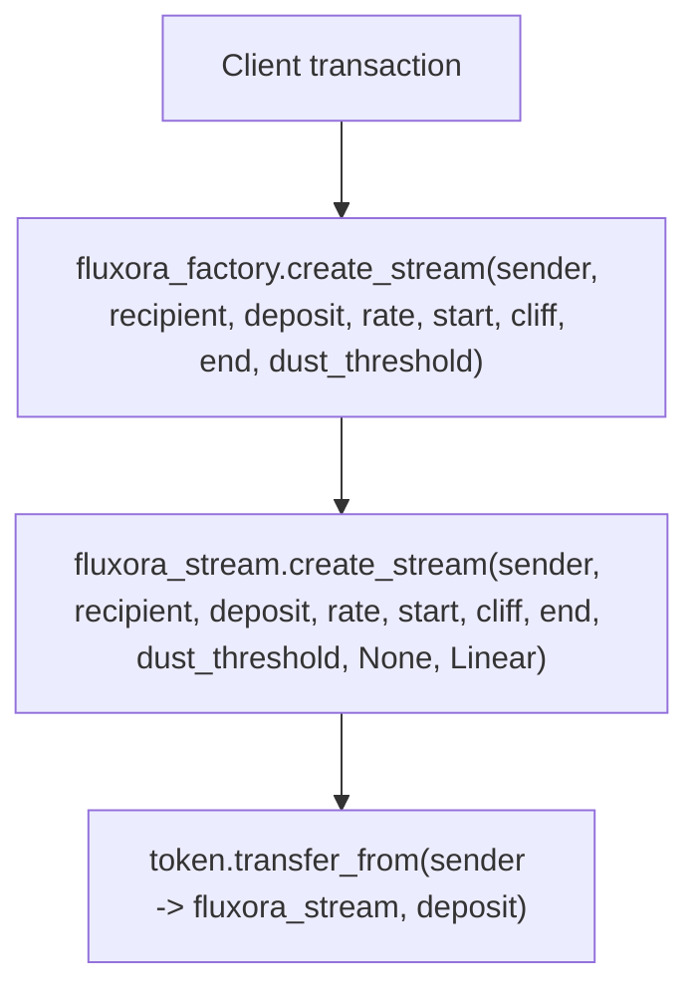

# Treasury Policy Factory Contract

The `fluxora_factory` contract is an optional wrapper around `FluxoraStream` designed specifically to enforce treasury compliance policies during stream creation.

## Overview

The base `FluxoraStream` contract is highly composable and intentionally un-opinionated about things like maximum stream sizes, minimum durations, and recipient identities. This makes it ideal as a protocol primitive. However, treasuries managing large token reserves often require strict operational policies. 

The `fluxora_factory` acts as a proxy entrypoint to enforce these policies:
- **Recipient Allowlist**: Streams can only be created for recipients explicitly allowlisted by the admin.
- **Deposit Caps**: Enforces a `MaxDepositCap` on the total `deposit_amount` of a single stream.
- **Minimum Duration**: Enforces a `MinDuration` (i.e. `end_time - start_time >= min_duration`), preventing overly short or instantaneous streams.

## Important Bypass Warning

> [!WARNING]
> Because the underlying `FluxoraStream` contract does not natively enforce these policies, **they are only enforced if the stream is created by routing through the factory contract.** 
> 
> If a user (e.g. the treasury multi-sig itself) directly calls `create_stream` on the `FluxoraStream` contract, these policies will be bypassed. To truly lock down treasury funds, the token vault or multi-sig must be configured to *only* approve transactions that invoke the `fluxora_factory` contract.

## Architecture & CEI

The factory contract follows the Checks-Effects-Interactions (CEI) pattern implicitly:
1. **Checks**: Validates the recipient against the allowlist, and bounds the deposit and duration against the configured caps.
2. **Effects**: No local persistent state changes occur during a successful stream creation.
3. **Interactions**: Makes a cross-contract call to `FluxoraStream::create_stream`.

## Cross-contract authorization model

Factory-routed creation has one client-facing entrypoint, but the sender authorization
must cover both the wrapper call and the nested stream call:



The required authorization scopes are:

| Signer | Scope | Why it is required |
| --- | --- | --- |
| `sender` | `fluxora_factory.create_stream(...)` with the exact wrapper arguments | `FluxoraFactory::create_stream` calls `sender.require_auth()` after policy checks pass. |
| `sender` | Nested `fluxora_stream.create_stream(...)` with the exact stream arguments the factory forwards | `FluxoraStream::create_stream` also calls `sender.require_auth()` before validating and pulling the deposit. |

This is not two independent user intents. A client should build the Soroban
authorization tree so the `sender` signs the factory invocation and its
`fluxora_stream.create_stream` sub-invocation in the same transaction. The nested
scope is intentionally narrow: it authorizes only the exact stream creation that
the factory forwards after enforcing recipient, cap, and duration policy.

The stream contract, not the factory, pulls `deposit_amount` from `sender` into
the stream contract during `fluxora_stream.create_stream`. The factory never
custodies the sender's tokens and has no standing privilege to spend sender
funds. If a later transaction tries to reuse the factory or a changed set of
arguments, the sender must authorize that new invocation tree again.

### Worked client-signing example

Assume a treasury UI wants to create this routed stream:

```text
sender = G_SENDER
recipient = G_RECIPIENT
deposit_amount = 1_000
rate_per_second = 1
start_time = 1_800_000_000
cliff_time = 1_800_000_000
end_time = 1_800_001_000
withdraw_dust_threshold = 0
```

The client prepares a transaction whose root host function invokes
`fluxora_factory.create_stream` with those values. During simulation/preparation,
the authorization tree must contain `G_SENDER` for the root factory call and the
nested `fluxora_stream.create_stream` sub-invocation with:

```text
memo = None
kind = Linear
```

`G_SENDER` signs that prepared authorization tree. The factory admin does not
sign stream creation unless the admin is also the `sender`. The recipient does
not sign creation. The recipient signs only later recipient-controlled actions
such as `withdraw` or `withdraw_to`.

### Single-auth vs dual-scope auth

For UI and wallet copy, describe the flow as "one sender signing session with two
scopes" rather than "two unrelated signatures":

1. The factory scope lets the sender opt into the treasury policy wrapper.
2. The stream scope lets the stream contract create the stream and pull exactly
   the authorized deposit from the sender.

If the client omits either scope, the transaction fails at the corresponding
`require_auth` call. If the sub-invocation arguments differ from the signed
arguments, the nested authorization is not valid for that call.

## Admin Controls

The factory has an `Admin` key managed via `set_admin`. The admin can:
- Call `set_allowlist` to grant or revoke recipient eligibility.
- Call `set_cap` to update the max deposit limit.
- Call `set_min_duration` to update the minimum duration requirement.
- Call `set_stream_contract` to upgrade or switch the underlying stream primitive if a new version is deployed.

The factory admin can shape policy and the target stream contract, but cannot
spend sender funds by itself. A factory-routed stream still needs the `sender`
authorization described above, and the underlying stream contract still enforces
its own authorization table. See the [`docs/security.md` admin powers
section](security.md#admin-powers) for the protocol-wide admin boundary.

## Code alignment checklist

This document is aligned with the current implementation as follows:

- `FluxoraFactory::create_stream` enforces allowlist, cap, and duration checks
  before calling `sender.require_auth()`.
- The factory forwards a linear `FluxoraStream::create_stream` call with
  `memo = None` and `StreamKind::Linear`.
- `FluxoraStream::create_stream` calls `sender.require_auth()` before validating
  parameters and pulling `deposit_amount` from `sender`.
- `contracts/stream/tests/factory_policy.rs` covers the factory policy gates and
  admin-guarded policy updates that surround this authorization model.
